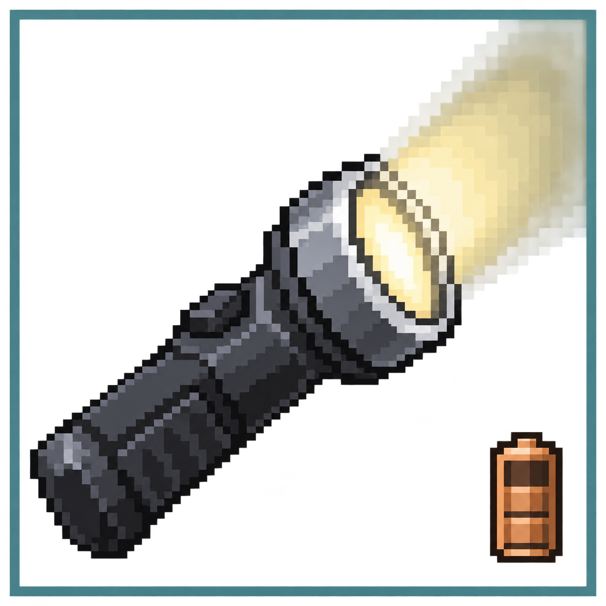
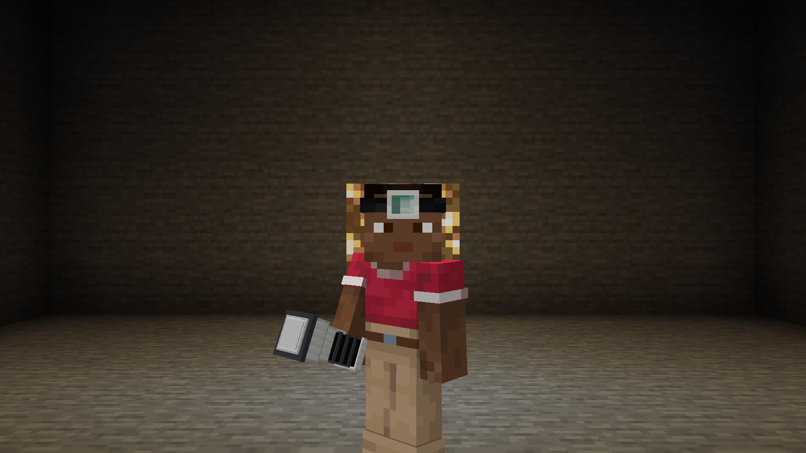
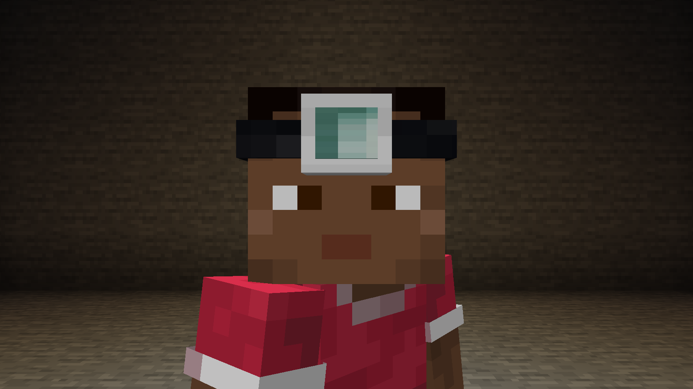

# Flashlight FE



A Minecraft **1.21.1 / NeoForge** flashlight mod by **LTDigor**. Rechargeable handheld lights, hands-free Curios use and reversible headband mounting.

## Install

Install `flashlight-fe-1.0.3.jar` on both client and server, with NeoForge **21.1.249+** within 21.1 and Curios **9.5.1+** within version 9. GeckoLib is not needed. JEI 19.18+ is optional; Immersive Engineering is supported through the standard FE item capability.

This version uses the new `bestflashlight` namespace. It is **not a drop-in update** for the previous personal-use `flashlight` derivative: old items, helmet upgrades and configuration are not migrated. Test in a new world before changing an existing installation.

## Use

- Craft a flashlight, then charge it in an FE item charger, such as Immersive Engineering's Charging Station. New lamps have no charge.
- Hold the flashlight in either hand. Handheld flashlights cannot be equipped in Curios. Old equipped flashlights return through Curios' inventory handler, preserving their charge, name and components; a full inventory drops them beside the player. Other mods' slots and items are unchanged.
- For a visible forehead mount, craft a headband from any wool and two strings. Combine it with a flashlight, then equip it in Curios' **head** slot. Armor helmets can be worn at the same time.
- Craft the loaded headband alone to detach the flashlight. The empty headband is returned. Charge, custom names and other components survive both operations; attachment and removal turn the lamp off. A loaded headband can also be charged directly.
- One enabled source emits per player: main hand, then offhand, then headband. Unequipped lamps do not consume power.
- Creative players can use all lamp forms with zero or partial charge without changing stored FE. Switching to survival restores the charge requirement and normal drain on the next server tick; switching to creative stops drain immediately.

JEI lists discharged and charged variants; charge does not interfere with recipe lookup. Tooltips show FE and switch state. A green charge bar appears below full charge; full batteries and empty headbands have no bar.

Two bindings appear under **Flashlight FE** in Minecraft Controls. Both accept keyboard or mouse buttons. The old saved flashlight binding is retained for the headband.

| Input | Result |
|---|---|
| Handheld, default **right mouse button**, flashlight in main hand | Toggle main flashlight; suppress normal use/block interaction |
| Right mouse button, empty main hand, offhand flashlight | Toggle offhand flashlight |
| Right mouse button, another item in main hand | Normal Minecraft use; offhand flashlight stays unchanged |
| Handheld rebound to another key/button | Main flashlight first, otherwise offhand, even with another item in main hand |
| Headband, default **I** | Toggle the headband in Curios `head`, independently of both hands |

One physical press toggles once; holding does not repeat. Screens and chat ignore lamp input. Rebinding handheld away from the right mouse button removes its toggle action from that button. Server checks the actual inventory for each request.

The handheld has a black mechanical button in a metal rim. Each accepted press animates for about 0.25 seconds, resting partly recessed when on and raised when off. Rapid presses continue from the current position. An empty survival battery still plays the press and release. The native renderer draws the body and moving button separately in first and third person; the server notifies the owner and tracking players. Animation state stays on the client.

## Gallery





## Configuration

NeoForge creates `config/bestflashlight-server.toml`, synchronizes it to clients and applies changes after a world/server restart.

| Setting | Default | Meaning |
|---|---:|---|
| `energyCapacity` | 10000 | Maximum stored FE |
| `energyPerTick` | 1 | FE per emitting tick; 0 disables consumption |
| `worksUnderwater` | true | Allow submerged emitters |
| `beamRange` | 12.0 | Beam length, 1–32 blocks |
| `coneAngleDegrees` | 15.0 | Full cone angle, 1–90 degrees |

At 20 TPS, the default battery lasts about 8 minutes 20 seconds. Vanilla block lighting supplies the illumination, so soft light spreads outside the source-placement cone. The mod preserves source water, avoids flowing water and plants, and cleans up temporary light when the lamp stops emitting. Overlapping beams share light without one player removing another player's contribution. Near walls, tracing falls back to the eye position instead of losing the whole beam. Headbands place sources at forward ray endpoints to reduce illumination around the player; a close wall retains a dim local source. Vanilla block light still spreads in all directions around each source.

## Source and assets

Flashlight FE uses its own cuboid models and native NeoForge renderer. Texture and click-sound references resolve to assets supplied by Minecraft; Minecraft assets are not bundled or relicensed. No other mod's models, textures, sounds or animations are included.

This repository contains the standalone implementation under the [MIT License](LICENSE), copyright 2026 LTDigor. Dependencies retain their own licenses; see [NOTICE](NOTICE). The internal `bestflashlight` IDs are retained so existing standalone items, saved bindings, components and configuration remain compatible. This rename does not migrate items from the older `flashlight` mod.

## Releases

Releases are published from `master` after review. Set `mod_version` in `gradle.properties` and add the matching section to `CHANGELOG.md`, then push. The release workflow builds the exact commit and uploads the same JAR to GitHub, CurseForge and Modrinth. A version already released is never overwritten. Repository variable `PUBLISH_ENABLED` must be `true`; publication is blocked while the repository is private.

If an upload times out, the workflow preserves an upload-intent receipt and stops automatic retries for that platform. Check the provider account, including files awaiting moderation, against the original release artifact before recovery. See the recovery instructions in [`scripts/release.py`](scripts/release.py). Successful uploads and their artifacts must not be replaced.

## Development

Use JDK 21 and import the Gradle project in IntelliJ IDEA.

```sh
./gradlew build
./gradlew runGameTestServer
./gradlew runClientSmoke
./gradlew runClientReloadSmoke
python3 scripts/test_multiplayer.py
```

Output: `build/libs/flashlight-fe-1.0.3.jar`.

GameTests exercise real FE charging, the IE station, crafting, Curios slots, beam geometry, water and shared ownership. Client smoke creates an isolated creative world and checks models, synchronization, both bindings, rebinding, held input, block interactions and button screenshots; reload smoke reopens it to check persistence and orphan cleanup. The multiplayer harness uses a creative player and a survival player on a disposable loopback server, checking FE behavior and press synchronization to the owner and observers. Test sources and IE are excluded from the production JAR; run files and screenshots are ignored by Git.
