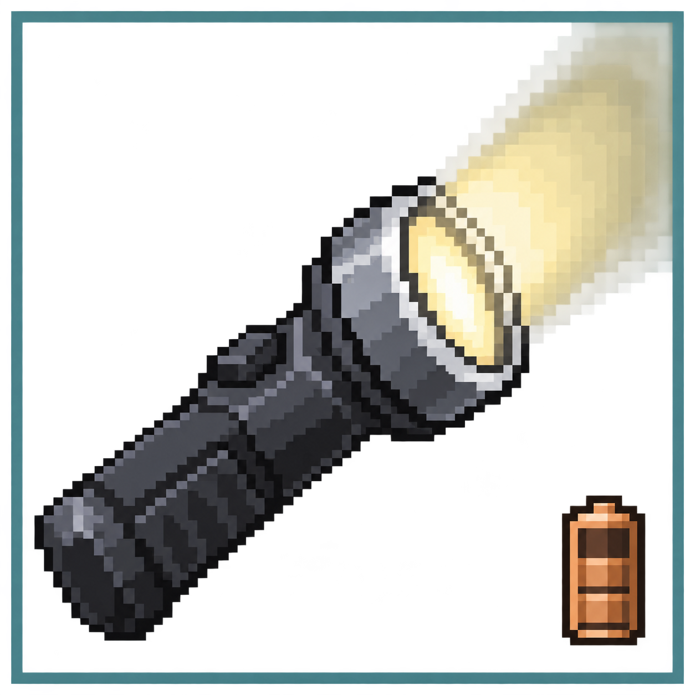

# Flashlight FE

Two rechargeable lights for **Minecraft 1.21.1 / NeoForge 21.1.249+ within 21.1**, by **LTDigor**. Install on both client and server. Curios 9.5.1+ within version 9 and JEI 19.18+ within version 19 are optional. GeckoLib is not required.

Version **1.0.0** is the authoritative initial version. Earlier development headbands and worlds are not migrated. Start a new world when replacing a development build.

## Items and recipes

- **Flashlight** (`bestflashlight:flashlight`): use in either hand.
- **Headlamp** (`bestflashlight:headlamp`): an independent lamp with its own battery. Right-click to equip an existing functional Curios `head` slot. Without Curios, or when no usable `head` slot exists, it uses vanilla's head slot instead of a helmet. Occupied Curios slots are not replaced. The mod never creates or resizes Curios slots.

Both recipes produce one discharged lamp. Charge with any compatible FE item charger, including Immersive Engineering's Charging Station. No empty headband, mounting or disassembly recipe exists.

| Flashlight | Headlamp |
| --- | --- |
| ` G ` | `SWS` |
| `IRI` | `IGI` |
| ` C ` | `CRC` |

G = glass, I = iron ingot, R = redstone, C = copper ingot, S = string, W = any wool. Neither lamp is an ingredient in the other's recipe.

## Controls and appearance

**Right mouse button** toggles the main-hand flashlight, or the offhand flashlight when the main hand is empty. Holding another item in the main hand preserves normal use. Rebind the handheld action to toggle offhand even with an occupied main hand. **I** toggles the equipped headlamp. Both bindings accept keyboard or mouse buttons; screens/chat ignore them and holding a key does not repeat.

One enabled, usable source emits per player: main hand, offhand, then headlamp. Unequipped lamps do not drain. Creative works with empty batteries without changing FE; survival requires power. Tooltips show charge/state, and a green bar shows partial charge.

The handheld has an octagonal graphite body, ribbed grip, recessed optic and moving orange button. The headlamp has a woven strap, side hinges, forehead optic and rear battery housing. Only enabled lenses are full-bright. Models work in both vanilla equipment and Curios; the latter can coexist with a helmet.

## Lighting and configuration

Server settings live in `config/bestflashlight-server.toml`. A world's `serverconfig/bestflashlight-server.toml` overrides that default. Values synchronize to clients and apply after restarting the world/server.

| Setting | Default | Range / meaning |
| --- | ---: | --- |
| `energyCapacity` | 10000 | Maximum stored FE |
| `energyPerTick` | 0.025 | FE per emitting tick; 0 disables consumption |
| `worksUnderwater` | true | Allow submerged emitters |
| `beamRange` | 12.0 | 1–32 blocks |
| `coneAngleDegrees` | 35.0 | 1–90 degrees, full cone angle |
| `beamBrightness` | 15 | 1–15, maximum light level |
| `beamSoftness` | 0.35 | 0–1, radial fraction occupied by the fading edge |

Default charge lasts about 5 hours 33 minutes at 20 TPS. The beam follows the view direction and clips at obstacles. Near walls, emitter placement falls back safely.

Without LambDynamicLights, temporary server light blocks illuminate the world. Their circular placement and intensity follow the cone, but Minecraft block light remains discrete and spreads beyond its sources. Source and flowing water are preserved; overlapping beams combine by maximum brightness and clear when no longer needed.

With a compatible, enabled LambDynamicLights, surfaces receive a soft circular light profile bounded by the cone. LDL still samples Minecraft's block grid, so narrow spots retain visible block-shaped shading; this is not a per-pixel shader spotlight. There is no glowing volumetric fog effect. The server stops its temporary lights only after all clients in the dimension acknowledge readiness. Mixed clients, disabled LDL, and incompatible APIs keep server fallback, preventing double illumination. Tested real LDL fixture: 4.8.11 for NeoForge 1.21.1.

## Build and test

Use Java 21 and `./gradlew build smokeClasses runGameTestServer`. Offline asset/recipe checks: `python3 -m unittest discover -s scripts -p '*_test.py'`.

The real client matrix uses `./gradlew runCompatibilityClient -PcompatCurios=absent|empty|head -PcompatLdl=false|true`. For LDL runs, also pass `-PbeamSmokeModDir=<directory-with-one-lambdynamiclights-jar>`. Run each value separately, or use `python3 scripts/test_compatibility.py --ldl-dir <directory>`.

`absent` removes Curios from the runtime classpath; `empty` loads Curios without slot fixtures; `head` adds an external test-only head-slot pack. Test classes/fixtures are never included in the production JAR. These clients create isolated disposable worlds, capture screenshots and record assertions under ignored `run-compat-*` directories.

Multiplayer: `python3 scripts/test_multiplayer.py`; add `--ldl-dir <directory>` to put real LDL on only the first client and verify mixed-client fallback. All test clients are muted.

CI runs checks and builds only. It does not upload artifacts or publish releases.

## License

MIT. Original industrial models/textures are generated by `scripts/generate_model_assets.py`; `--check` verifies reproducibility. Minecraft and third-party dependencies retain their respective licenses; see [NOTICE](NOTICE).
